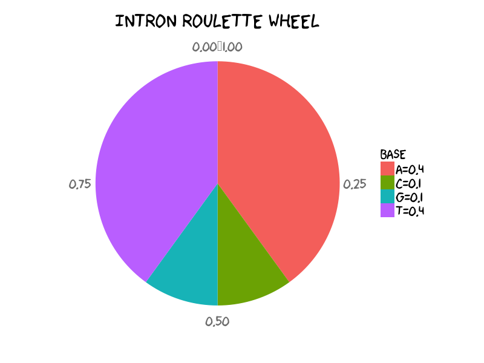

Model and Predict RBP Binding Preference
==================================================

With methods mentioned in previous chapter we could hopefully distinguish the informative signals from the sequencing noises. Results achieved at this step could be enough for most exploratory researches. However, what if we take a further step? What could we learn from the confident results? Could we learn about the binding preference of RNA binding proteins and construct models to unveil why RBP binds here but not there? Could we even predict the global binding sites of RBP? It does not necessarily means making CLIP-seq *in silico* possible, but machine learning methods could yield promising supplement to the real signals which are often left out due to the empirical thresholding. 

Hidden Markov Model, SVM, Graph Kernel, Random forest have been applied in researches investigating RBP binding preferences with high-quality publications. 

.. _c20-HMM:

Hidden Markov Model
-------------------------

In the beginning of this section I would like to introduce HMM by a toy application: 5' end splicing site recognition, which was originated from NBT paper [Eddy2004]_. Admittedly this toy HMM is naive, it hopefully could help you take first step knowing how to infer the most possible splicing site by simply starting from raw DNA/RNA sequence together with some prior knowledges, for example sequence: ``CTTCATGTGAAAGCAGACGTAAGTCA``. Series of concepts and elements of HMM would be illustrated step by step so that you could see how the biological question was translated to mathematical questions and *vice versa*. Hopefully after you have known HMM I would introduce how HMM was employed in RBP science researches ([Han2014]_ and [Zhang2013]_). 

Sequence Path v.s. State Path
^^^^^^^^^^^^^^^^^^^^^^^^^^^^^^^^^^^^^^^^^^^^^^^^^^^^^

For one thing, transcriptome or genome sequence could be read by sequencing and thus is observed. Four basic types of nucleotides (A, T, C, G) come together to form a **sequence path**. For another, each nucleotide residing on the DNA string belongs to some bio-functional regions. They could be either exons to be transcribed in the mature RNA, or introns to be spliced out, or splicing site, the boundary of exon and intron. These regions of different functions could be described as different states. Likewise, the **state path** is composed of "E", "I", and "5", denoting "Exon", "Intron" and "5'-end Splicing Site" respectively. 

For convenience we disregard 3' end splicing sites in our toy HMM. 

For example:: 

	Sequence Path: CTTCATGTGAAAGCAGACGTAAGTCA
	State    Path: EEEEEEEEEEEEEEEEEE5IIIIIII

Therefore the ultimate goal of locating the splicing site is to figure out the state of each nucleotide and find the one under splicing site state. Generally speaking, given the sequence path we try to infer the state path. 

Why Hidden? 
^^^^^^^^^^^^^^^^^^^^^^^^^^^^^^^^^^^^^^^^^^^^^^^^^^^^

At first sight whether GC-rich or AT-rich of a DNA string could be quickly determined given the sequence path, however you could barely figure out the state path immediately. This is where the "hidden" comes from. 

To uncover the dark matter, the observed sequence path alone cannot help us to reveal the unobserved state path. With additional prior knowledge, for example, the distribution of A/T/G/C in each state, we could unveil the most possible E/I/5 state path in a **top-bottom** fashion. 

Think in HMM
^^^^^^^^^^^^^^^^^^^^^^^^^^^^^^^^^^^^^^^^^^^^^^^^^^^^

Suppose we have understood the unknown dark matter in the bottom and all the prior knowledge. Let's think in HMM to generate a DNA sequence in **bottom-up** fashion. Oh, calm down, just playing roulette wheel. 

Emission Probs
""""""""""""""""""""""""""""""""""""""""""""""""""""

Let's play with intron state and under intron state we set the bases distribution as: ::

	    A   C   G   T
	I 0.4 0.1 0.1 0.4

	Distribution of A, C, G, T in toy intron. It means that in general within intron regions you would expect each 40% of A and T, each 10% G and C. *(See R scripts to generate pie chart in final section in case of your curiosity)*

The **emission probabilities** under intron state could be described as the above roulette wheel. To generate a DNA string given the emission probabilities of intron, it is straightforward to implement sampling intron sequence of 26nt using ``sample`` function in ``R`` language:  

.. code-block:: r 
	
	> set.seed(1026)
	> dna.bases <- c("A", "C", "G", "T")
	> intron.emission.prob <- c(0.40, 0.10, 0.10, 0.40)
	> seq.len <- 26
	> sample.seq <- sample(x = dna.bases, prob = intron.emission.prob, 
							size = seq.len, replace = T)
	> cat(sample.seq, "\n")
	A C A G A A A A A A A T G A T A A A C A G G G A A T 

You could even double-check whether the generated string follows your prior set distribution. I give you result of a long sequence, i.e. 1000nt by setting ``seq.len <- 1000`` without changing other lines of codes:  

.. code-block:: r

	> table(sample.seq)
	sample.seq
	  A   C   G   T 
	396  81 101 422

Emission probabilities of each state is dedicated to generate observed base. Don't forget we assume we are HMM now. If we clearly know state status of each base, we could immediately sample its nucleotide given the emission probabilities. Previously we set ``seq.len`` as ``26`` or ``1000`` to generate sequence of corresponding length. In the same way, we could assign the individual base of intron a nucleotide by setting ``seq.len <- 1``.  

This story under intron state could be exactly applied to exon, splicing sites states as well. Thus we have three wheels of emission probabilities under three different states. 

Transition Probs
""""""""""""""""""""""""""""""""""""""""""""""""""""

HMM has a feature: the next state is determined by ongoing state, or ongoing state is determined by previous one. For example, now we know we are under "Exon" state. When we considering generating next one, we are hesitating between whether continuing "Exon", or changing to "Splicing Site" state. Moving from one state to another state is exactly determined by **transition probabilities**. 

Though emission and transition probabilities have different biological missions: generating sequence and state path respectively. Their mathematical principle are exactly same - sampling something following multinomial model. 

Let's assume exon status has the following transition probabilities: 

.. code-block:: r

	> state.bases <- c("E", "5", "I")
	> exon.transition.prob <- c(0.9, 0.1, 0)
	> exon.transition.matrix <- matrix(exon.transition.prob, nrow = 1, 
										byrow = T)
	> colnames(exon.transition.matrix) <- state.bases
	> row.names(exon.transition.matrix) <- "E"
	> print(exon.transition.matrix)
	    E   5 I
	E 0.9 0.1 0

It means the probability of continuing exon state is 0.9 whereas changing to 5' end splicing site state is 0.1. You could tell that transition probabilities describe the linear order in which we expect the states to occur: one or more Es, one 5, one or more Is. Note that in our toy model exon cannot directly jump to intron state. 

You cannot be unfamiliar with the following codes to choose state for next base: 

.. code-block:: r

	> set.seed(1026)
	> sample.state <- sample(x = state.bases, prob = exon.transition.prob, 
							size = 1, replace = T)
	> cat(sample.state)
	E

Generate sequence
""""""""""""""""""""""""""""""""""""""""""""""""""""

So far hopefully you clear have learned: 
	
- Generating sequence path purely under one state, i.e. intron
- Determine state of next base when current base is under certain state, i.e. exon

Next before generating sequences and of course state path we need make the emission and transition probabilities to the full story: 

.. figure:: _static/HMMandSplicingSite_Mx.png
	:scale: 50 %
	:align: center

	Diagram showing emission and transition probabilities matrix [Eddy2004]_. 

In particular there are additional "Start" and "End" states for model purpose. These two states have no base assignment and they serve as the ``^`` and ``$`` in the regular expression in programming. In the figure the transition probability from "Start" to "Exon" state is ``1.0`` which means in our toy example here we are going to generate sequence starting with "Exon". Likewise the probability of continuing "Intron" is ``0.9``. 

The full emission probabilities matrix would be: 

.. code-block:: bash

		A    C    G    T
	S   0.00 0.00 0.00 0.00
	E   0.25 0.25 0.25 0.25
	SS5 0.05 0.00 0.95 0.00
	I   0.40 0.10 0.10 0.40
	N   0.00 0.00 0.00 0.00

The full transition probabilities matrix would be: 

.. code-block:: bash

	    S   E SS5   I   N
	S   0 1.0 0.0 0.0 0.0
	E   0 0.9 0.1 0.0 0.0
	SS5 0 0.0 0.0 1.0 0.0
	I   0 0.0 0.0 0.9 0.1
	N   0 0.0 0.0 0.0 1.0

Check the source R script to find ``GenerateHMMSeq`` function. 

.. literalinclude:: _scripts/c20HMM/c20HMM_generate_demo.R
    :language: r

After you type the following in the R console, Aha, a sequence with HMM in mind is generated. 

.. code-block:: r

	> set.seed(1026)
	> GenerateHMMSeq(emmisionMx=myEmisMtx, transitionMx=myTransMtx, len=20)
	Start
	Base 1 is A under E 
	Base 2 is A under E 
	Base 3 is C under E 
	Base 4 is G under E 
	Base 5 is G under E 
	Base 6 is T under E 
	Base 7 is C under E 
	Base 8 is C under E 
	Base 9 is C under E 
	Base 10 is G under SS5 
	Base 11 is G under I 
	Base 12 is A under I 
	Base 13 is T under I 
	Base 14 is T under I 
	Base 15 is T under I 
	End
	Seq Path: A A C G G T C C C G G A T T T 
	StatPath: E E E E E E E E E SS5 I I I I I N 
	[1] 1

You must have noticed that in this case the length of output sequence is 15 though 20 is pre-defined. Is it wrong? No, because the probability of changing from "Intron" to "End" state is ``0.1``, not ``0``, Ongoing "Intron" state is possible to choose "End" state for next base so that the generating process would be pre-terminated.  

Judge Possible State Path
^^^^^^^^^^^^^^^^^^^^^^^^^^^

So far hopefully you have known how to think in HMM to generate sequence path and state path given the transition and emission probabilities matrix available. Now back to our original goal: locating 5'-end splicing site. Now out mind goes in **top-bottom** direction and our mission is to find the state path with highest probabilities given the observed sequence path. 

Compute Probability of State Path
"""""""""""""""""""""""""""""""""

Recall our example: 

.. code-block:: bash

	Sequence Path: CTTCATGTGAAAGCAGACGTAAGTCA
	State    Path: EEEEEEEEEEEEEEEEEE5IIIIIII

Given the observed sequence of 26nt, how likely do you think is the state path among the hundreds of combinations? In general :math:`{\mathbf P}\left(\mathbf{s},\pi \mid \text{HMM},\theta\right)` of an Hidden Marcov Model with parameters ( :math:`\theta` ) generates a state path ( :math:`\pi` ) and an observed sequence ( :math:`\mathbf{s}` ) , is the product of all the emission probabilities and transition probabilities that were used: 

.. math::
	
	\left( 0.25^{18} * 0.95 * 0.4^3 * 0.1 * 0.1 * 0.4^2 \right) * \left(1 * 0.9^{17} * 0.1 * 1 * 0.9^6 * 0.1 \right)

26nt sequence has 26 emissions and 27 transitions (note the final end state).

See ``ComputeStatePathProb`` function for details: 

.. literalinclude:: _scripts/c20HMM/c20HMM_compute_prob_demo.R
	:language: r

and it could yield: 

.. code-block:: r

	> demo.seq.path <- c("CTTCATGTGAAAGCAGACGTAAGTCA")
	> demo.state.path <- c("EEEEEEEEEEEEEEEEEE5IIIIIII")
	> ComputeStatePathProb(seqPath = demo.seq.path, statePath = demo.state.path, 
	                     transMtx = myTransMtx, emisMtx = myEmisMtx, log = TRUE)
	[1] -41.21968

Enumerate State Paths 
""""""""""""""""""""""""

	Most possible state path. 

Among all the possible combinations of state path, how to pick up the most possible state path? There is one naive way: enumerate all the candidates, compute their probability, and pick up the highest one. The code is : 

.. literalinclude:: _scripts/c20HMM/c20HMM_best_state_demo.R
	:language: r

Running ``InspectorHMM`` would yield: 

.. code-block:: r

	> InspectorHMM(demo.seq.path, myTransMtx, myEmisMtx)
	[1] "All State Path with non-zero Probability: "
	[1] "EEEE5IIIIIIIIIIIIIIIIIIIII"
	[1] 2.904208e-21
	[1] "EEEEEE5IIIIIIIIIIIIIIIIIII"
	[1] 8.621866e-20
	[1] "EEEEEEEE5IIIIIIIIIIIIIIIII"
	[1] 1.347167e-19
	[1] "EEEEEEEEE5IIIIIIIIIIIIIIII"
	[1] 4.431469e-21
	[1] "EEEEEEEEEE5IIIIIIIIIIIIIII"
	[1] 2.769668e-21
	[1] "EEEEEEEEEEE5IIIIIIIIIIIIII"
	[1] 1.731043e-21
	[1] "EEEEEEEEEEEE5IIIIIIIIIIIII"
	[1] 8.222452e-20
	[1] "EEEEEEEEEEEEEE5IIIIIIIIIII"
	[1] 6.761885e-21
	[1] "EEEEEEEEEEEEEEE5IIIIIIIIII"
	[1] 3.211895e-19
	[1] "EEEEEEEEEEEEEEEE5IIIIIIIII"
	[1] 1.056545e-20
	[1] "EEEEEEEEEEEEEEEEEE5IIIIIII"
	[1] 1.254647e-18
	[1] "EEEEEEEEEEEEEEEEEEEE5IIIII"
	[1] 2.579454e-20
	[1] "EEEEEEEEEEEEEEEEEEEEE5IIII"
	[1] 1.612159e-20
	[1] "EEEEEEEEEEEEEEEEEEEEEE5III"
	[1] 7.657755e-19
	Best State Path and original Sequence 
	EEEEEEEEEEEEEEEEEE5IIIIIII 
	CTTCATGTGAAAGCAGACGTAAGTCA 
	Maximum Probability: 1.25464666093437e-18 
	Maximum Prob (log):  -41.2196776860225 
	Posterior Decoding:  0.461971754327234 
	[1] "EEEEEEEEEEEEEEEEEE5IIIIIII"

The best state path is ``EEEEEEEEEEEEEEEEEE5IIIIIII`` of sequence path ``CTTCATGTGAAAGCAGACGTAAGTCA``. 

Hopefully you have understood the principles of HMM. Obviously we cannot use the enumerate methods because when the length of sequence is increasing we could barely afford the time and computing resources to do that. We do have smarter algorithms.

Viterbi algorithm
""""""""""""""""""""

Estimate HMM in action
^^^^^^^^^^^^^^^^^^^^^^^^

In the 5'-end splicing end recognition toy model, the emission and transition probabilities are presumed so that we could estimate the most possible state path which is the best explanation for the observed sequence. 

But another big question is where we could know about the emission and transition probabilities of HMM before we tackle HMM? How could we learn the parameters of HMM? The solutions to this question would be split into two branches: supervised learnings and unsupervised learnings. The algorithms behind these, for example Baum-Welch algorithm, would be introduced. Luckily there are several convenient ``R`` packages that associate with HMM. 

* HMM
* RHmm
* depmixS4
* mhsmm

The context here is modeling and even predict RBP binding preference. As previously mentioned in Chapter 1, the sequenced tags generated in CLIP-seq experiments are considered the binding regions of RBP. The continuous regions with high signals, called RBP binding cluster,  indicate high affinity between these RNA regions and RBP. 

With observed CLIP-seq tags and therefore the sequence of RBP binding clusters, we are trying to train HMM model wit best explanations to the observed path. 

.. Super-easy to use. But when inferring the parameters of HMM, the observation can only be one. *AD one. I thought it is even dead end. 

Supervised Learning
"""""""""""""""""""

Unsupervised Learning
"""""""""""""""""""""

To model PTB binding preference, two-state HMM was designed based on triplets in order to assess whether 3nt motif would segregate into two states and whether these two states had distinct emission probabilities [Han2014]_. 

Unlike the research of [Zhang2013]_ where CLIP-seq tags were treated as positive training data set, interestingly the PTB binding cluster identified by CLIP-seq was used in unsupervised learnings. It still makes sense that there were minor regions associating PTB non-binding due to several biological reasons: 

* Recall the step during CLIP-seq library construction. When the single-strand RNA was digested by enzyme, for example `MNase <http://en.wikipedia.org/wiki/Micrococcal_nuclease>`_, the RNA-protein complex is protected from digestion. It does not necessarily means that all the unbound RNA is depleted, in other words there might be certain escaped residues existed flanking the RNA-protein complex. 

	Scheme from FOX2 CLIP-seq paper [Yeo2009]_ . 

* Footprint is one of the binding features of RBP. If the binding clusters are centered by their very position of highest reads, a "footprint" of RBP would be observed. It indicates the binding sites are not necessarily precise sites, but more likely a short of regions. With this in mind, there are regions highly associated with RBP binding and others less associated. 

	Footprint of Ago CLIP-seq paper [Chi2009]_ . 

Collectively there are regions of RNA could be sequenced within CLIP-seq tags and thus provide evidence to make inference about the non-binding state. 

We could implement the codes to reproduce the results by using ``RHmm`` package with the following brief analysis pipeline: 

- Raw data retrieve and munging; 
- Construct observed sequence path for each read; 
- Design two-state HMM; 
- Estimate emission and transition probabilities, the parameters (:math:`\theta` ) of HMM; 
- Visualization of results. 

If you are not interested in data cleaning which ironically takes up 90% of time of most data scientists, you could jump to HMM estimation. 

:underline:`CLIP-seq Data Retrieve`. PTB CLIP-seq sequencing reads were mapped to hg17 and adapted to hg18 in the latest `GEO data <http://www.ncbi.nlm.nih.gov/geo/query/acc.cgi?acc=GSE19323>`_ . Author had kindly provided the genome coordinations of CLIP-seq peak clusters so that we could easily fetch the genome and transcript sequence of CLIP-seq clusters by using ``Bioconductor``. 

.. literalinclude:: _scripts/c20HMM/c20HMM_PTB_get_data.R
    :language: r

:underline:`Cook Observed Sequence Path`. For each read the sequence is continuously string, for example *ACTGATCGG* string and they are not triplet-sequence: *ACT GAT CGG*. In addition the format of cluster sequence is still in DNA, not RNA. Therefore one more step is needed to cook data. 

.. literalinclude:: _scripts/c20HMM/c20HMM_PTB_cook_data.R
    :language: r

:underline:`Design HMM`. Two-state HMM was designed: binding state or non-binding state. 

	PTBP1 protein binding model. A: Two-states HMM was designed and successfully trained. Transition probabilities was shown. B: Emission probabilities of the two states had different preference to triplets. 

We are trying to reproduce it. 

:underline:`Estimation`. 

.. literalinclude:: _scripts/c20HMM/c20HMM_PTB_estimate_model.R
    :language: r

As a result we have estimated the parameters of HMM modeling PTB binding preferences. 

.. code-block:: r

	> ptb.HMM.estimated$HMM

	Model:
	------
	2 states HMM with discrete distribution

	Initial probabilities:
	       Pi 1      Pi 2
	  0.3139217 0.6860783

	Transition matrix:
	          State 1   State 2
	State 1 0.8149683 0.1850317
	State 2 0.7304111 0.2695889

	Conditionnal distribution parameters:

	Distribution parameters:
	                AAA         AAC         AAG         AAU         ACA
	State 1 0.002383142 0.001988302 0.003097821 0.004226146 0.001995432
	State 2 0.025786133 0.025971278 0.018121069 0.028874057 0.024075226
	                ACC          ACG         ACU         AGA         AGC
	State 1 0.004296758 0.0009777614 0.008180572 0.003830718 0.005312564
	State 2 0.018605290 0.0042242069 0.049004140 0.015416027 0.014005746
	                AGG         AGU         AUA        AUC         AUG        AUU
	State 1 0.005096352 0.007593413 0.004129317 0.01496485 0.005350854 0.01376565
	State 2 0.015004130 0.019397553 0.014655807 0.03411788 0.025050705 0.04595246
	                CAA         CAC        CAG        CAU         CCA         CCC
	State 1 0.005554373 0.007190527 0.01082647 0.01789752 0.012993299 0.011660492
	State 2 0.013752790 0.020121812 0.01413175 0.02473606 0.003593826 0.004166092
	                CCG        CCU          CGA          CGC          CGG
	State 1 0.003661999 0.03098681 0.0013783022 0.0024944800 4.214447e-03
	State 2 0.000200509 0.02205868 0.0007302127 0.0009282014 6.182563e-05
	                CGU         CUA        CUC         CUG        CUU         GAA
	State 1 0.005119809 0.016649674 0.04569612 0.043974551 0.06312030 0.005524635
	State 2 0.001815995 0.008282352 0.01444509 0.008600124 0.01674955 0.011585987
	                GAC         GAG         GAU         GCA         GCC
	State 1 0.003385939 0.005436000 0.006501759 0.006188076 0.007126983
	State 2 0.011575944 0.007221552 0.012970029 0.008728458 0.010754741
	                GCG        GCU         GGA         GGC         GGG         GGU
	State 1 0.001602458 0.01690951 0.007828274 0.008870517 0.008232480 0.020662642
	State 2 0.001314269 0.02532439 0.003275595 0.003563300 0.002490208 0.003476972
	                GUA        GUC         GUG        GUU          UAA         UAC
	State 1 0.008955899 0.02164476 0.018687619 0.02221290 0.0002625711 0.002043933
	State 2 0.003858372 0.02117789 0.006428045 0.02471246 0.0365923675 0.040823962
	                UAG         UAU         UCA         UCC          UCG
	State 1 0.001035275 0.009639421 0.029376269 0.033462720 0.0066478156
	State 2 0.033052139 0.052877132 0.004428215 0.008469919 0.0002484275
	               UCU        UGA        UGC         UGG        UGU         UUA
	State 1 0.09058445 0.01043319 0.01899602 0.026031526 0.03641284 0.017888266
	State 2 0.02857544 0.02020113 0.01821159 0.006386885 0.03774479 0.001871079
	                UUC        UUG         UUU
	State 1 0.069744980 0.03439432 0.072667103
	State 2 0.008481177 0.00497244 0.005968508

:underline:`Visualization`. Since human eyes are more sensitive to changes in horizontal length, I prefer to putting emission probabilities at the x-axis and also the triplet sequence in the y-axis so that you don't need to twist you head. 

.. literalinclude:: _scripts/c20HMM/c20HMM_PTB_visualize_model.R
    :language: r

:underline:`Short Discussion`. My emission probabilities plot is consistent with the published figure. CU-rich motifs are ranked in the top in both results. But I would guess that maybe there is typo error denoting the transition probabilities in the paper: :math:`\mathbf{P}\left(state2 \Rightarrow state1\right)` and :math:`\mathbf{P}\left(state2 \Rightarrow state2\right)` should be exchanged. It makes clear sense under State 1. Think in HMM again. :math:`\mathbf{P}\left(state1 \Rightarrow state1\right)` is larger than :math:`\mathbf{P}\left(state1 \Rightarrow state2\right)` so that under State 1 it would more likely stick with State 1 rather change to State 2. It is consistent to  the big presumption that CLIP-seq sequenced reads are highly associated with RBP binding with tolerance of some minor non-binding regions. If :math:`\mathbf{P}\left(state2 \Rightarrow state1\right)`  were 0.78 and :math:`\mathbf{P}\left(state2 \Rightarrow state2\right)` were 0.22, State 2 would prefer sticking to itself as well and the principle of CLIP-seq technology would be violated badly. 

My transition probabilities matrix: 

.. code-block:: bash

          State 1   State 2
	State 1 0.8149683 0.1850317
	State 2 0.7304111 0.2695889

On State 1 our results are similar to published paper with in mind that different initial value would lead to different outcome. On the other hand, the pattern of State 2 is opposite. 

.. _c20-SVM:

SVM
-------------------------

.. _c20-GraphKernel: 

Graph Kernel
-------------------------

.. _c20-RandomForest:

Random Forest
-------------------------

References
-------------------------

.. [Chi2009] Chi, Sung Wook, et al. "Argonaute HITS-CLIP decodes microRNA–mRNA interaction maps." Nature 460.7254 (2009): 479-486.

.. [Yeo2009] Yeo, Gene W., et al. "An RNA code for the FOX2 splicing regulator revealed by mapping RNA-protein interactions in stem cells." Nature structural & molecular biology 16.2 (2009): 130-137.

.. [Eddy2004] Eddy, S. R. What is a hidden Markov model? Nat. Biotechnol. 22, 1315–1316 (2004).

.. [Zhang2013] Zhang, Chaolin, et al. "Prediction of clustered RNA-binding protein motif sites in the mammalian genome." Nucleic acids research 41.14 (2013): 6793-6807.

.. [Han2014] Han, Areum, et al. "De Novo Prediction of PTBP1 Binding and Splicing Targets Reveals Unexpected Features of Its RNA Recognition and Function." PLOS Computational Biology 10.1 (2014).
